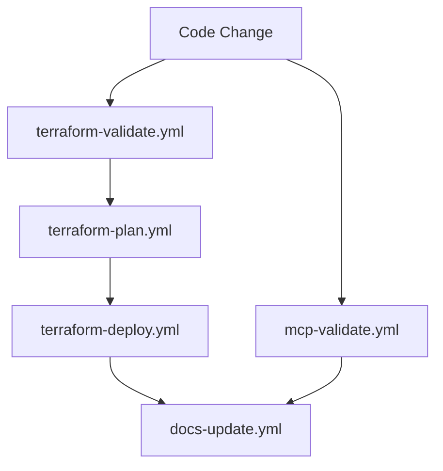

# GitHub Actions Workflows

This directory contains CI/CD workflows for automated infrastructure management and validation.

## 🚀 Available Workflows

### Core Infrastructure Workflows

#### 1. **terraform-validate.yml**
- **Trigger**: PR/Push to `terraform-aws-django/`
- **Purpose**: Validates Terraform code quality
- **Features**:
  - Format checking (`terraform fmt`)
  - Configuration validation
  - Security scanning with tfsec
  - Runs on every PR

#### 2. **terraform-plan.yml** 
- **Trigger**: PR to main, Manual dispatch
- **Purpose**: Generate and review deployment plans
- **Features**:
  - Creates Terraform execution plan
  - Posts plan details as PR comments
  - Saves plan artifacts for deployment
  - Supports multiple environments

#### 3. **terraform-deploy.yml**
- **Trigger**: Manual dispatch only
- **Purpose**: Deploy/destroy infrastructure
- **Features**:
  - Environment-specific deployments
  - Manual approval gates
  - Artifact-based deployments
  - Rollback support with destroy option

### MCP Integration Workflows

#### 4. **mcp-validate.yml**
- **Trigger**: Changes to MCP configuration files
- **Purpose**: Validate MCP server configurations
- **Features**:
  - JSON syntax validation
  - Package availability checks
  - Configuration report generation
  - Supports both `.mcp.json` and `mcp.json`

### Documentation Workflows

#### 5. **docs-update.yml**
- **Trigger**: Changes to infrastructure or docs
- **Purpose**: Automatic documentation generation
- **Features**:
  - Terraform documentation with terraform-docs
  - MCP status documentation
  - Project status dashboard
  - Auto-commits updated docs

## 🔧 Setup Requirements

### GitHub Secrets
```
AWS_ACCESS_KEY_ID     # AWS access key for Terraform
AWS_SECRET_ACCESS_KEY # AWS secret key for Terraform
```

### GitHub Variables
```
AWS_REGION           # AWS region (default: us-east-1)
```

### Environment Protection Rules
Create GitHub environments:
- `dev` - Auto-approval
- `staging` - Manual approval
- `prod` - Manual approval + additional reviewers

## 📋 Usage Examples

### Validate Infrastructure Changes
```bash
# Automatic on PR creation
git checkout -b feature/new-infrastructure
# Make changes to terraform-aws-django/
git push origin feature/new-infrastructure
# Creates PR → triggers validation + plan workflows
```

### Deploy Infrastructure
```bash
# Go to GitHub Actions → terraform-deploy.yml → Run workflow
# Select environment: dev/staging/prod
# Select action: apply/destroy
# Enable auto_approve if needed (be careful!)
```

### Update Documentation
```bash
# Automatic on infrastructure changes
git push origin main
# Or manually trigger docs-update.yml workflow
```

## 🛡️ Security Features

### Terraform Security
- **tfsec scanning** for security vulnerabilities
- **Plan review** before any deployments
- **Environment protection** with manual approvals
- **Artifact-based deployments** for consistency

### MCP Security
- **Package verification** before deployment
- **Configuration validation** to prevent errors
- **Access token management** through GitHub secrets

## 🔄 Workflow Dependencies



## 📊 Monitoring

### Workflow Status
- All workflows report status in GitHub Actions tab
- Failed workflows block deployments
- Success/failure notifications available

### Documentation Updates
- Automatic updates on infrastructure changes
- Generated documentation in `docs/` directory
- Project status dashboard maintenance

## 🏷️ Best Practices

1. **Always run validation** before deployment
2. **Review plans carefully** in PR comments
3. **Use environment protection** for production
4. **Monitor workflow execution** for failures
5. **Keep secrets updated** and secure

---

**🤖 Generated**: This documentation is automatically maintained by the CI/CD system.